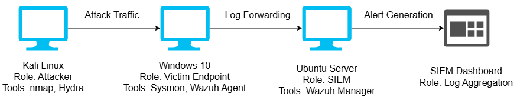
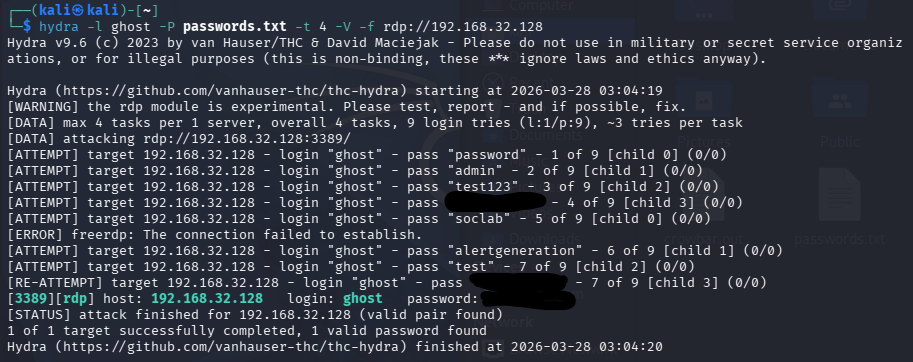
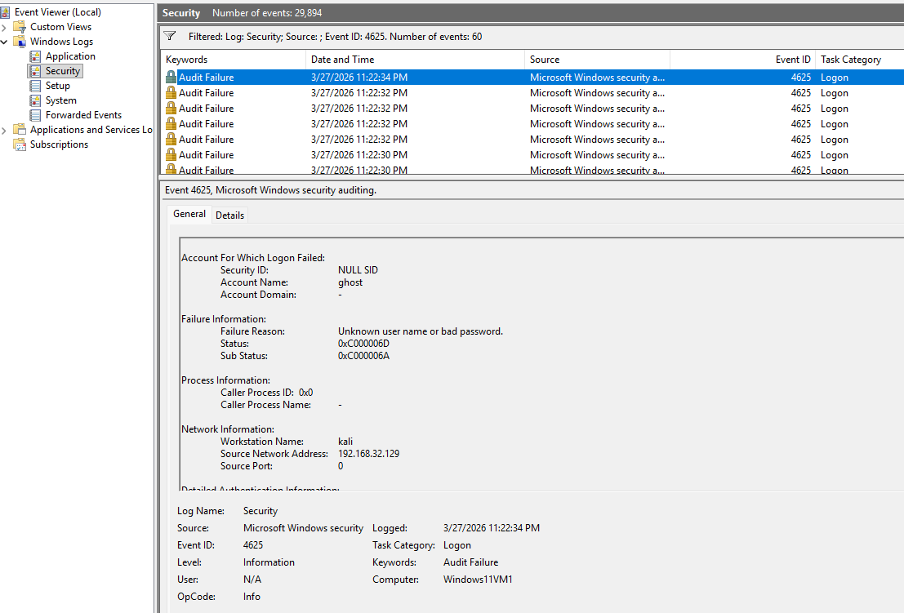
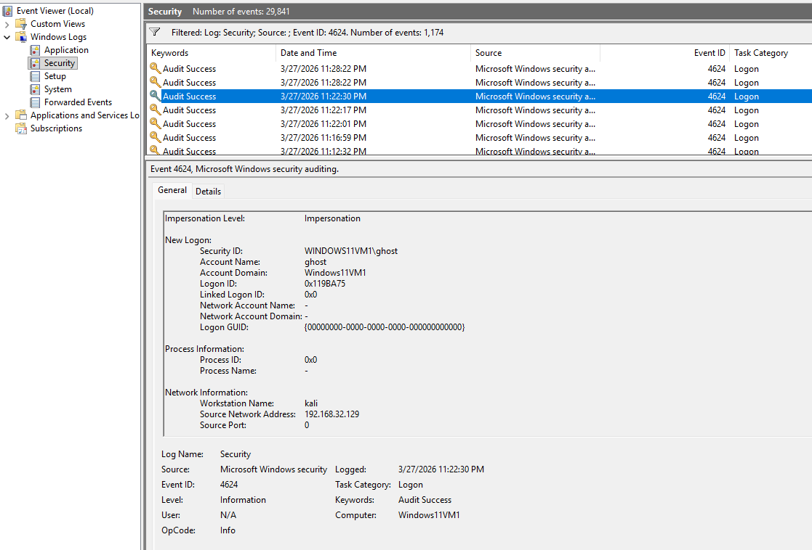
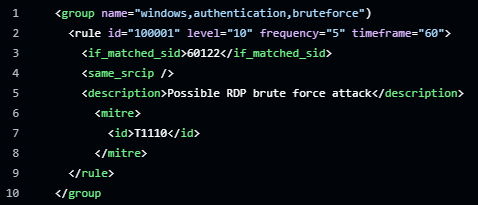
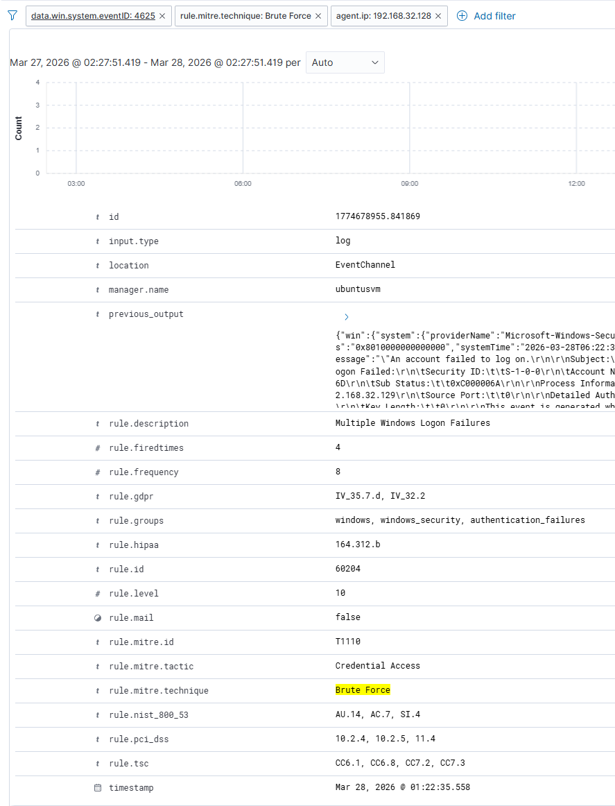

# SOC Brute Force Detection (Wazuh SIEM)

## Overview
This project simulates a brute force attack against a Windows 11 system using Hydra from Kali Linux and detects the activity using Wazuh SIEM.

The goal is to demonstrate real-world SOC analyst skills including attack simulation, log analysis, and detection rule creation aligned with MITRE ATT&CK. 

## Lab Environment and Architecture
- **Attacker**: Kali Linux VM
- **Target**: Windows 11 VM
- **SIEM**: Ubuntu Wazuh server
- **Protocol**: RDP (Port 3389)

It is a Windows 11 endpoint, not Windows 10. Also tool used is Event Viewer, not Sysmon.

## Attack Simulation
Hydra was used to perform a brute force attack against RDP.

hydra -l ghost -P passwords.txt -t 4 -V -f rdp://192.168.32.128

## Log Analysis
Windows generated multiple failed login events and a successful login event.
- **Event IDs**: 4625 (Failed Logon), 4624 (Successful Logon)
- **Logon Type**: 10 (Remote Interactive/RDP), 3 (Network Connection)
- **Source IP**: Kali Linux attacker

## Detection Rule
Custom Wazuh rule created to detect brute force behavior:

[Detection Rule](detection-rules/local_rules.xml)

## MITRE ATT&CK Mapping, Query Used, and Alert Result
- T1110 - Brute Force
- data.win.system.eventID:4625
The rule triggered after multiple failed login attempts from the same source IP.

## Key Takeaways
- Simulated real-world RDP brute force attack
- Analyzed Windows authentication logs
- Built custom SIEM detection rule
- Validated alerting in Wazuh

#
Author: Michael Schwartz

LinkedIn: https://www.linkedin.com/in/michael-schwartz-115a69221/
